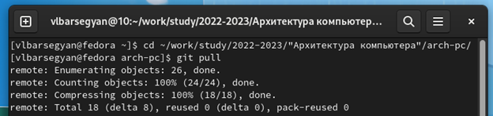
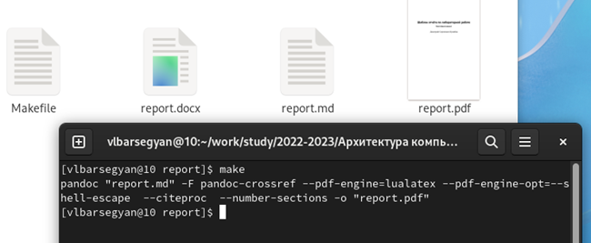
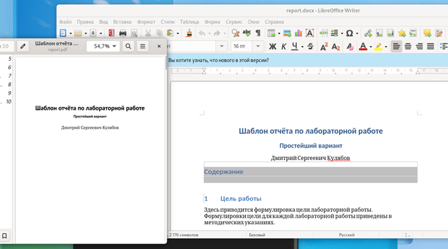
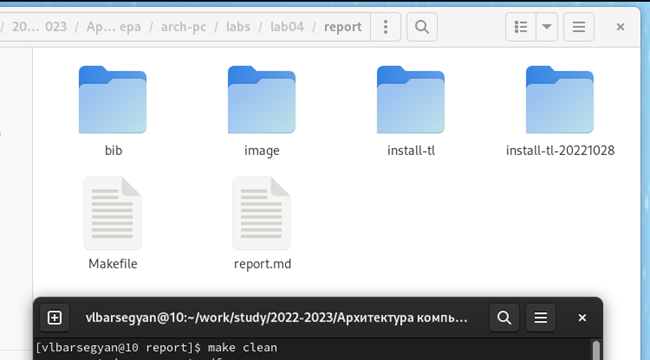
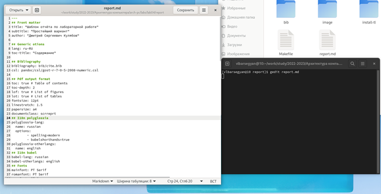
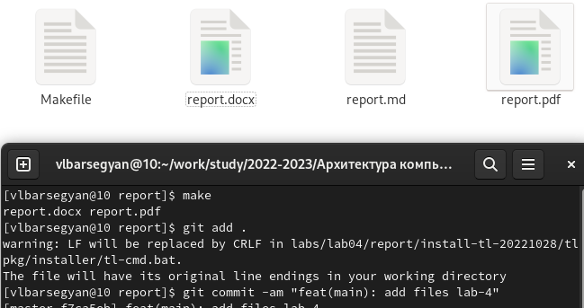
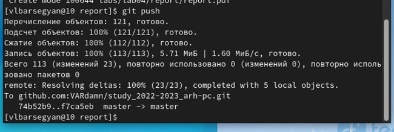
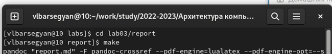
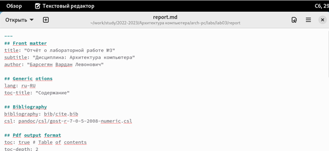
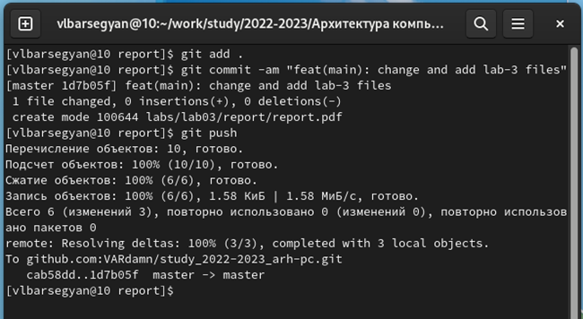

---
## Front matter
title: "Отчет о лабораторной работе №4"
subtitle: "Дисциплина: Архитектура компьютера"
author: "Барсегян вардан Левонович"

## Generic otions
lang: ru-RU
toc-title: "Содержание"

## Bibliography
bibliography: bib/cite.bib
csl: pandoc/csl/gost-r-7-0-5-2008-numeric.csl

## Pdf output format
toc: true # Table of contents
toc-depth: 2
lof: true # List of figures
lot: true # List of tables
fontsize: 12pt
linestretch: 1.5
papersize: a4
documentclass: scrreprt
## I18n polyglossia
polyglossia-lang:
  name: russian
  options:
	- spelling=modern
	- babelshorthands=true
polyglossia-otherlangs:
  name: english
## I18n babel
babel-lang: russian
babel-otherlangs: english
## Fonts
mainfont: PT Serif
romanfont: PT Serif
sansfont: PT Sans
monofont: PT Mono
mainfontoptions: Ligatures=TeX
romanfontoptions: Ligatures=TeX
sansfontoptions: Ligatures=TeX,Scale=MatchLowercase
monofontoptions: Scale=MatchLowercase,Scale=0.9
## Biblatex
biblatex: true
biblio-style: "gost-numeric"
biblatexoptions:
  - parentracker=true
  - backend=biber
  - hyperref=auto
  - language=auto
  - autolang=other*
  - citestyle=gost-numeric
## Pandoc-crossref LaTeX customization
figureTitle: "Рис."
tableTitle: "Таблица"
listingTitle: "Листинг"
lofTitle: "Список иллюстраций"
lotTitle: "Список таблиц"
lolTitle: "Листинги"
## Misc options
indent: true
header-includes:
  - \usepackage{indentfirst}
  - \usepackage{float} # keep figures where there are in the text
  - \floatplacement{figure}{H} # keep figures where there are in the text
---

# Цель работы

Целью работы является освоение процедуры оформления отчетов с помощью
легковесного языка разметки Markdown

# Техническое обеспечение
* [TeX Live последней версии](https://www.tug.org/texlive/)
* [Pandoc версии v2.18](https://pandoc.org/)
* [Pandoc-crossref версии v0.3.13.0](https://github.com/lierdakil/pandoc-crossref/releases)

# Выполнение лабораторной работы

1. Перехожу в каталог курса (/work/study/2022-2023/"Архитектура компьютера"/arch-pc/) и обновляю локальный репозиторий, скачав изменения из удаленного репозитория с помощью команды (Рис.1 [-@pic1])
{#pic1 width=70%}

2. Перехожу в каталог лабораторной работы №4 (/labs/lab04/report/) и провожу компиляцию шаблона с использованием Makefike, используя команду *make* ((Рис.2 [-@pic2]))
{#pic2 width=70%}

3. Открываю файлы и проверяю корректность полученных файлов (Рис.3 [-@pic3])
{#pic3 width=70%}

4. Удаляю полученные файлы с использованием Makefile с помощью команды  *make clean* и убеждаюсь, что файлы report.docx и report.pdf были удалены ((Рис.4 [-@pic4]))
{#pic3 width=70%}

5. Открываю файл report.md с помощью gedit используя команду *gedit report.md* ((Рис.5 [-@pic5]))
{#pic5 width=70%}

6. Компилирую отчет и загружаю файлы на Github ((Рис.6 [-@pic6]), (Рис.6.1 [-@pic6_1]))
{#pic6 width=70%}
{#pic6_1 width=70%}

# Задание для самостоятельной работы
1. Перехожу в каталог c лабораторной работой №3, компилирую шаблон с помощью команды *make* ((Рис.7 [-@pic7]))
{#pic7 width=70%}

2. Выполняю отчет о лабораторной работе №3 в формате Markdown ((Рис.8 [-@pic8]))
{#pic8 width=70%}

3.Загружаю файлы на Github ((Рис.9 [-@pic9]))
{#pic9 width=70%}

# Выводы

Я освоил процедуру оформления отчетов с помощью легковесного языка разметки Markdown, базовый синтаксис Markdown, а также научился компилировать отчеты

