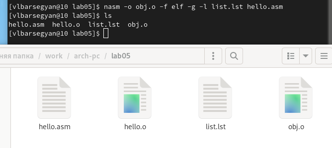
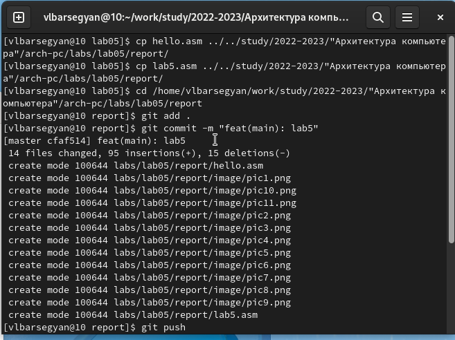

---
## Front matter
title: "Отчёт о лабораторной работе №5"
subtitle: "Дисциплина: архитектура компьютера"
author: "Барсегян Вардан Левонович НПИбд-01-22"

## Generic options
lang: ru-RU
toc-title: "Содержание"

## Bibliography
bibliography: bib/cite.bib
csl: pandoc/csl/gost-r-7-0-5-2008-numeric.csl

## Pdf output format
toc: true # Table of contents
toc-depth: 2
lof: true # List of figures
lot: true # List of tables
fontsize: 12pt
linestretch: 1.5
papersize: a4
documentclass: scrreprt
## I18n polyglossia
polyglossia-lang:
  name: russian
  options:
	- spelling=modern
	- babelshorthands=true
polyglossia-otherlangs:
  name: english
## I18n babel
babel-lang: russian
babel-otherlangs: english
## Fonts
mainfont: Arial Unicode MS
romanfont: Arial Unicode MS
sansfont: Arial Unicode MS
monofont: Arial Unicode MS
mainfontoptions: Ligatures=TeX
romanfontoptions: Ligatures=TeX
sansfontoptions: Ligatures=TeX,Scale=MatchLowercase
monofontoptions: Scale=MatchLowercase,Scale=0.9

## Pandoc-crossref LaTeX customization
figureTitle: "Рис."
tableTitle: "Таблица"
listingTitle: "Листинг"
lofTitle: "Список иллюстраций"
lotTitle: "Список таблиц"
lolTitle: "Листинги"
## Misc options
indent: true
header-includes:
  - \usepackage{indentfirst}
  - \usepackage{float} # keep figures where there are in the text
  - \floatplacement{figure}{H} # keep figures where there are in the text
---

# Цель работы

Освоение процедуры компиляции и сборки программ, написанных на ассемблере NASM.

# Выполнение лабораторной работы
## Программа Hello World!
1. Создаю каталог для работы с программами на языке ассемблера NASM с помощью команды *mkdir ~/work/arch-pc/lab05* и перехожу в данный каталог (Рис. [-@pic:001])
{ #pic:001 width=70% }

2. Создайте текстовый файл с именем hello.asm и открываю его с помощью утилиты gedit (Рис. [-@pic:002])
{ #pic:002 width=70% }

3. Копирую текст из лабораторной работы и вставляю его в файл (Рис. [-@pic:003])
{ #pic:003 width=70% }

## Транслятор NASM
4. Компилирую программу из файла hello.asm в объектный код с помощью команды *nasm -f elf hello.asm* (Рис. [-@pic:004]). Полученный файл имеет такое же название, как и исходный, но с расширением .о . Также с помощью команды ls проверяю, что объектный файл был создан
{ #pic:004 width=70% }

## Расширенный синтаксис командной строки NASM
5. Выполняю команду *nasm -o obj.o -f elf -g -l list.lst hello.asm* и проверяю наличие созданных файлов с помощью команды *ls*(Рис. [-@pic:005])
{ #pic:005 width=70% }

## Компоновщик LD
6. Передаю на обработку компоновщику объектный файл, чтобы получить исполняемую программу, используя команду *ld -m elf_i386 hello.o -o hello*. Также с помощью команды *ls* проверяю, что исполняемый файл создался (Рис. [-@pic:006])
{ #pic:006 width=70% }

7. Выполняю следующую команду: *ld -m elf_i386 obj.o -o main* (Рис. [-@pic:007]). Полученный исполняемый файл имеет название *main*, а исходный объектный - *obj.o*
{ #pic:007 width=70% }

## Запуск исполняемого файла
8. Запускаю созданный исполняемый файл с помощью команды *./hello* в командной строке (Рис. [-@pic:008])
{ #pic:008 width=70% }

# Задание для самостоятельной работы

1. С помощью команды cp создаю копию файла hello.asm с именем lab5.asm (Рис. [-@pic:009])
{ #pic:009 width=70% }

2. С помощью утилиты gedit открываю файл lab5.asm и меняю текст для вывода на строку с моей фамилией и именем (Рис. [-@pic:010])
{ #pic:010 width=70% }

**Текст измененной программы:**
; hello.asm
SECTION .data ; Начало секции данных
hello: DB 'Barsegyan Vardan',10 ; 'Barsegyan Vardan' плюс
; символ перевода строки
helloLen: EQU $-hello ; Длина строки hello
SECTION .text ; Начало секции кода
GLOBAL _start
_start: ; Точка входа в программу
mov eax,4 ; Системный вызов для записи (sys_write)
mov ebx,1 ; Описатель файла '1' - стандартный вывод
mov ecx,hello ; Адрес строки hello в ecx
mov edx,helloLen ; Размер строки hello
int 80h ; Вызов ядра
mov eax,1 ; Системный вызов для выхода (sys_exit)
mov ebx,0 ; Выход с кодом возврата '0' (без ошибок)
int 80h ; Вызов ядра

3. Транслирую полученный текст программы lab5.asm в объектный файл с помощью команды *nasm -f elf lab5.asm*, выполняю компоновку объектного файла (команда *d -m elf_i386 lab5.o -o lab5 *) и запускаю получившийся исполняемый файл командой *./lab5* (Рис. [-@pic:011])
{ #pic:011 width=70% }

4. Копирую файлы hello.asm и lab5.asm в локальный репозиторий в каталог ~/work/study/2022-2023/"Архитектура компьютера"/arch-pc/labs/lab05/ (Рис. [-@pic:012])
{ #pic:012 width=70% }

# Выводы

Я освоил процедуры компиляции и сборки программ, написанных на ассемблере NASM, научился пользоваться транслятором NASM, расширенным синтаксисом командной строки NASM, компоновщиком LD и запускать исполняемый файл. Также я загрузил обновления на github.
