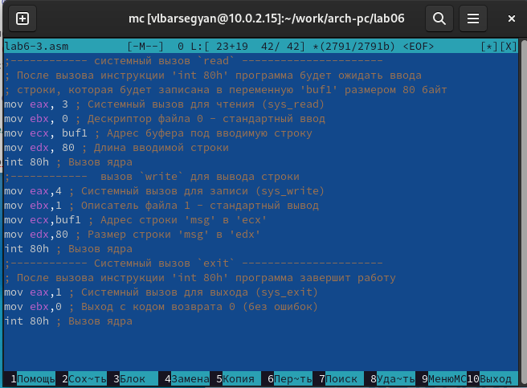

---
## Front matter
title: "Отчёт о лабораторной работе №6"
subtitle: "Дисциплина: Архитектура компьютера"
author: "Барсегян Вардан Левонович НПИбд-01-22"

## Generic otions
lang: ru-RU
toc-title: "Содержание"

## Bibliography
bibliography: bib/cite.bib
csl: pandoc/csl/gost-r-7-0-5-2008-numeric.csl

## Pdf output format
toc: true # Table of contents
toc-depth: 2
lof: true # List of figures
lot: true # List of tables
fontsize: 12pt
linestretch: 1.5
papersize: a4
documentclass: scrreprt
## I18n polyglossia
polyglossia-lang:
  name: russian
  options:
	- spelling=modern
	- babelshorthands=true
polyglossia-otherlangs:
  name: english
## I18n babel
babel-lang: russian
babel-otherlangs: english
## Fonts
mainfont: PT Serif
romanfont: PT Serif
sansfont: PT Sans
monofont: PT Mono
mainfontoptions: Ligatures=TeX
romanfontoptions: Ligatures=TeX
sansfontoptions: Ligatures=TeX,Scale=MatchLowercase
monofontoptions: Scale=MatchLowercase,Scale=0.9
## Biblatex
biblatex: true
biblio-style: "gost-numeric"
biblatexoptions:
  - parentracker=true
  - backend=biber
  - hyperref=auto
  - language=auto
  - autolang=other*
  - citestyle=gost-numeric
## Pandoc-crossref LaTeX customization
figureTitle: "Рис."
tableTitle: "Таблица"
listingTitle: "Листинг"
lofTitle: "Список иллюстраций"
lotTitle: "Список таблиц"
lolTitle: "Листинги"
## Misc options
indent: true
header-includes:
  - \usepackage{indentfirst}
  - \usepackage{float} # keep figures where there are in the text
  - \floatplacement{figure}{H} # keep figures where there are in the text
---

# Цель работы

Приобретение практических навыков работы в Midnight Commander. Освоение
инструкций языка ассемблера mov и int.

# Выполнение лабораторной работы

1. Открываю midnight commander, используя команду *mc* (рис. [-@fig:001])

{ #fig:001 width=70% }

2. Используя стрелки и клавишу Enter, перехожу в директорию ~/work/arch-pc (рис. [-@fig:002])

{ #fig:002 width=70% }

3. С помощью клавиши F7 создаю директорию и перехожу в нее (рис. [-@fig:003])

{ #fig:003 width=70% }

4. Создаю с помощью команды *touch* файл lab6-1.asm (рис. [-@fig:004])

{ #fig:004 width=70% }

5. Используя клавишу f4, открываю созданный файл (рис. [-@fig:005])

{ #fig:005 width=70% }

6. Ввожу код программы и сохраняю файл клавишей f2 (рис. [-@fig:006])

{ #fig:006 width=70% }

7. Закрываю файл клавишей f10 (рис. [-@fig:007])

{ #fig:007 width=70% }

8. Проверяю содержимое файла клавишей f3 (рис. [-@fig:008])

{ #fig:008 width=70% }

9. Транслирую текст программы lab6-1.asm в объектный файл командой *nasm -f elf lab6-1.asm
*; выполняю компоновку объектного файла командой * ld -m elf_i386 -o lab6-1 lab6-1.o
*; запускаю полученный исполняемый файл, ввожу данные (рис. [-@fig:009])

{ #fig:009 width=70% }

## Подключение внешнего файла in_out.asm

10. Скачиваю файл in_out.asm (рис. [-@fig:010])

{ #fig:010 width=70% }

11. Копирую файл in_out.asm в директорию ~/work/arch-pc/lab06/ с помощью клавиши f5 (рис. [-@fig:011])

{ #fig:011 width=70% }

12. Создаю копию файла lab6-1.asm с именем lab6-2.asm: выделяю файл lab6-1.asm, нажимаю клавишу F6, ввожу имя файла lab6-2.asm и нажимаю Enter (рис. [-@fig:012])

{ #fig:012 width=70% }

13. Меняю текст программы в соответствии с листингом 6.2 и сохраняю изменения в файле lab6-2.asm (рис. [-@fig:013])

{ #fig:013 width=70% }

14. Создаю исполняемый файл и проверяю его работу (рис. [-@fig:014])

{ #fig:014 width=70% }

15. В файле lab6-2.asm меняю подпрограмму sprintLF на sprint, создаю исполняемый файл и проверяю его работу (рис. [-@fig:015]). Разница между подпрограммами sprintLF и  sprint в том, что первая подпрограмма считывает строку с новой строки, а вторая - в той же строке, т е у нее отсутствует символ перевода строки

{ #fig:015 width=70% }

# Задание для самостоятельной работы

1. Делаю копию файла lab6-1.asm (рис. [-@fig:016])

{ #fig:016 width=70% }

2. Редактирую текст программы lab6-3.asm, добавляя в него вывод вводимой с клавиатуры строки (рис. [-@fig:017])

{ #fig:017 width=70% }

3. Получаю исполняемый файл и проверяю работу программы (рис. [-@fig:018])

{ #fig:018 width=70% }

4. Делаю копию файла lab6-2.asm (рис. [-@fig:019])

{ #fig:019 width=70% }

5. Редактирую текст программы lab6-4.asm, добавляя в него вывод вводимой с клавиатуры строки (рис. [-@fig:020])

{ #fig:020 width=70% }

6. Получаю исполняемый файл и проверяю работу программы (рис. [-@fig:021])

{ #fig:021 width=70% }

# Выводы

Я освоил работу с midnight commander и его базовые функции, такие как открытие, редактирование, сохранение и копирование файла. Также я научился работать с языком ассемблера NASM, изучил инструкции mov, int и структуру данного языка

