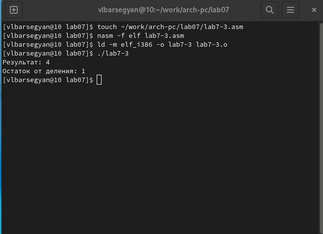

---
## Front matter
title: "Отчёт по лабораторной работе №7"
subtitle: "Дисциплина: Архитектура компьютера"
author: "Барсегян Вардан Левонович НПИбд-01-22"

## Generic otions
lang: ru-RU
toc-title: "Содержание"

## Bibliography
bibliography: bib/cite.bib
csl: pandoc/csl/gost-r-7-0-5-2008-numeric.csl

## Pdf output format
toc: true # Table of contents
toc-depth: 2
lof: true # List of figures
lot: true # List of tables
fontsize: 12pt
linestretch: 1.5
papersize: a4
documentclass: scrreprt
## I18n polyglossia
polyglossia-lang:
  name: russian
  options:
	- spelling=modern
	- babelshorthands=true
polyglossia-otherlangs:
  name: english
## I18n babel
babel-lang: russian
babel-otherlangs: english
## Fonts
mainfont: PT Serif
romanfont: PT Serif
sansfont: PT Sans
monofont: PT Mono
mainfontoptions: Ligatures=TeX
romanfontoptions: Ligatures=TeX
sansfontoptions: Ligatures=TeX,Scale=MatchLowercase
monofontoptions: Scale=MatchLowercase,Scale=0.9
## Biblatex
biblatex: true
biblio-style: "gost-numeric"
biblatexoptions:
  - parentracker=true
  - backend=biber
  - hyperref=auto
  - language=auto
  - autolang=other*
  - citestyle=gost-numeric
## Pandoc-crossref LaTeX customization
figureTitle: "Рис."
tableTitle: "Таблица"
listingTitle: "Листинг"
lofTitle: "Список иллюстраций"
lotTitle: "Список таблиц"
lolTitle: "Листинги"
## Misc options
indent: true
header-includes:
  - \usepackage{indentfirst}
  - \usepackage{float} # keep figures where there are in the text
  - \floatplacement{figure}{H} # keep figures where there are in the text
---

# Цель работы

Освоение арифметических инструкций языка ассемблера NASM.

# Выполнение лабораторной работы

## Символьные и численные данные в NASM

1. Создаю каталог для программ лабораторной работы № 7, перехожу в него и создаю файл lab7-1.asm (рис. [-@fig:001])

{ #fig:001 width=70% }

2. Копирую текст программы в созданный файл, также помещаю в директорию файл in_out.asm; создаю исполняемый файл и запускаю его (рис. [-@fig:002])

{ #fig:002 width=70% }

3. Меняю текст программы, создаю исполняемый файл и запускаю его (рис. [-@fig:003]). Символ на экране по таблице ASCII соответствует символу ◙

{ #fig:003 width=70% }

4. Создаю файл lab7-2.asm и ввожу в него текст программы. Создаю исполняемый файл и запускаю его (рис. [-@fig:004])

{ #fig:004 width=70% }

5. Меняю текст программы в новом файле, создаю исполняемый файл и запускаю его (рис. [-@fig:005]). В консоли выводится число 10

{ #fig:005 width=70% }

6. В файле заменяю функцию iprintLF на iprint, создаю исполняемый файл и запускаю его. (рис. [-@fig:006]). В консоли число 10 выводится без переноса строки

{ #fig:006 width=70% }

## Выполнение арифметических операций в NASM

7. Создаю файл lab7-3.asm, ввожу в него текст программы. Создаю исполняемый файл и запускаю его (рис. [-@fig:007])

{ #fig:007 width=70% }

8. Изменяю текст программы для вычисления другой функции, создаю исполняемый файл и запускаю его (рис. [-@fig:008])

{ #fig:008 width=70% }

9. Создаю файл variant.asm и копирую в него текст программы. Создаю исполняемый файл и запускаю его (рис. [-@fig:009]). Проверяю аналитически полученный вариант

{ #fig:009 width=70% } 

10. Ответы на вопросы:
1) За вывод этого сообщения на экран отвечают строки:
mov eax,rem
call sprint
2) Благодаря эти строчкам в переменную считывается и записывается значение студенческого билета
3) Эта команда преобразует ascii-код символа в целое число и записывает результат в регистр eax
4) Вычисление варианта происходит в строчках:
mov eax,x
call atoi 
xor edx,edx
mov ebx,20
div ebx
inc edx
Перед этим в регистр edx записывается 80 (mov edx, 80)
5) При выполнении инструкции div ebx остаток от деления запишется в регистр edx
6) Команда inc edx увеличивает значение регистра edx на 1
7) За вывод в консоль результата вычисления отвечают строки:
mov eax,edx
call iprintLF

# Задание для самостоятельной работы

1. Создаю файл task.asm для выполнения С/Р с помощью команды *touch task.asm* (рис. [-@fig:010])

{ #fig:010 width=70% }
 
2. В файле task.asm пишу текст программы для выполнения варианта 6, после чего запускаю программу на значениях х1=2 и х2=5 и проверяю работу программы (рис. [-@fig:011])

{ #fig:011 width=70% }

# Выводы

Я изучил арифметические инструкции языка NASM и научился их применять. Также я написал программу для вычисления значения функции 

