---
## Front matter
title: "Отчёт по лабораторной работе №8"
subtitle: "Дисциплина: Архитектура компьютера"
author: "Барсегян Вардан Левонович НПИбд-01-22"

## Generic otions
lang: ru-RU
toc-title: "Содержание"

## Bibliography
bibliography: bib/cite.bib
csl: pandoc/csl/gost-r-7-0-5-2008-numeric.csl

## Pdf output format
toc: true # Table of contents
toc-depth: 2
lof: true # List of figures
lot: true # List of tables
fontsize: 12pt
linestretch: 1.5
papersize: a4
documentclass: scrreprt
## I18n polyglossia
polyglossia-lang:
  name: russian
  options:
	- spelling=modern
	- babelshorthands=true
polyglossia-otherlangs:
  name: english
## I18n babel
babel-lang: russian
babel-otherlangs: english
## Fonts
mainfont: PT Serif
romanfont: PT Serif
sansfont: PT Sans
monofont: PT Mono
mainfontoptions: Ligatures=TeX
romanfontoptions: Ligatures=TeX
sansfontoptions: Ligatures=TeX,Scale=MatchLowercase
monofontoptions: Scale=MatchLowercase,Scale=0.9
## Biblatex
biblatex: true
biblio-style: "gost-numeric"
biblatexoptions:
  - parentracker=true
  - backend=biber
  - hyperref=auto
  - language=auto
  - autolang=other*
  - citestyle=gost-numeric
## Pandoc-crossref LaTeX customization
figureTitle: "Рис."
tableTitle: "Таблица"
listingTitle: "Листинг"
lofTitle: "Список иллюстраций"
lotTitle: "Список таблиц"
lolTitle: "Листинги"
## Misc options
indent: true
header-includes:
  - \usepackage{indentfirst}
  - \usepackage{float} # keep figures where there are in the text
  - \floatplacement{figure}{H} # keep figures where there are in the text
---

# Цель работы

Изучение команд условного и безусловного переходов. Приобретение навыков написания программ с использованием переходов. Знакомство с назначением и структурой файла листинга.

# Выполнение лабораторной работы

## Реализация переходов в NASM

1. Создаю каталог для лабораторной работы № 8, перехожу в него и создаю файл lab8-1.asm (рис. 1 [-@fig:001])

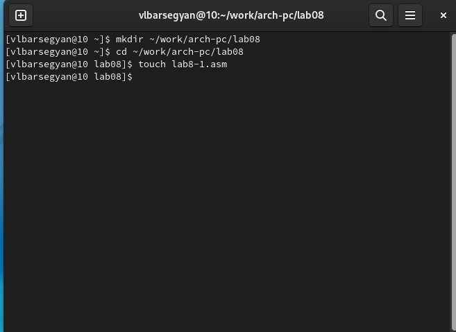{ #fig:001 width=70% }

2. Ввожу в созданный файл текст программы, создаю исполняемый файл и запускаю его (рис. 2 [-@fig:002])

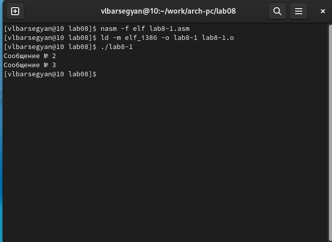{ #fig:002 width=70% }

3. Меняю текст программы, создаю исполняемый файл и запускаю его (рис. 3 [-@fig:003]). Теперь сообщения выводятся в другом порядке

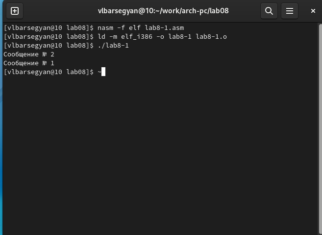{ #fig:003 width=70% }

4. Меняю текст программы самостоятельно так, чтобы программа выводила сообщения в другом порядке (рис. 4 [-@fig:004])

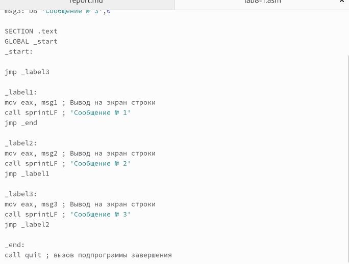{ #fig:004 width=70% }

5.  Создаю исполняемый файл, запускаю его и проверяю правильность работы (рис. 5 [-@fig:005])

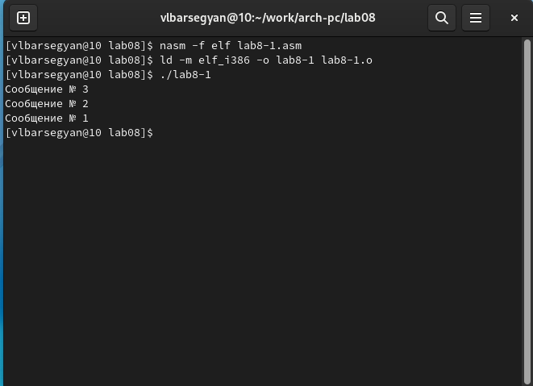{ #fig:005 width=70% }

6. Cоздаю файл lab8-2.asm, ввожу в него текст программы, создаю исполняемый файл и запускаю его (рис. 6 [-@fig:006])

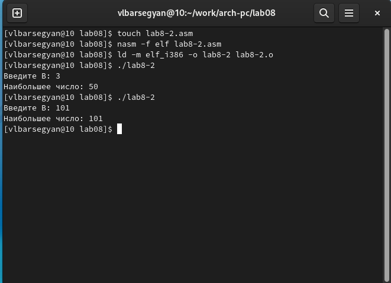{ #fig:006 width=70% }

## Изучение структуры файлы листинга

7. Создаю файл листинга с помощью команды *nasm -f elf -l lab8-2.lst lab8-2.asm* и открываю его с помощью текстового редактора (рис. 7 [-@fig:007]). 2, 3 и 4 строки этого файла - это листинг первых трех строк файла *in_out.asm*

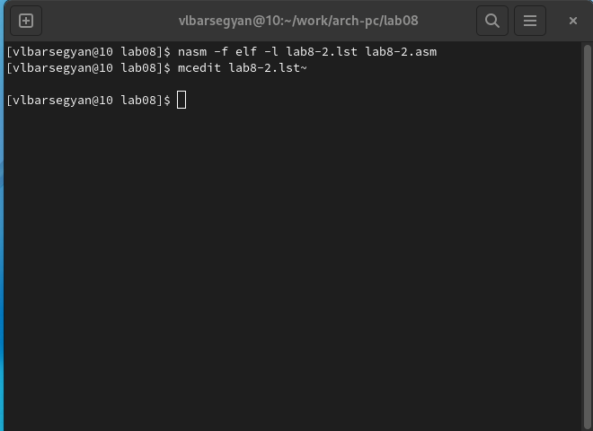{ #fig:007 width=70% }

8. Удаляю из инструкции *mov eax, msg2* второй операнд (рис. 8 [-@fig:008]). При выполнении трансляции не создался файл *lab8-2.o*, а в файл *lab8-2.lst* записалась ошибка на этой строчке (рис. 9 [-@fig:009])

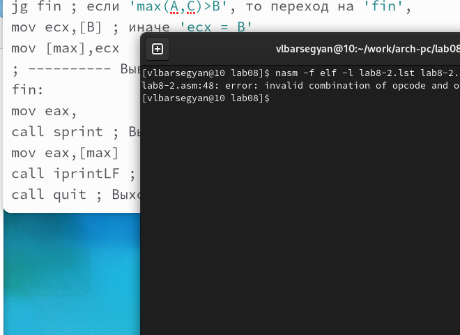{ #fig:008 width=70% }

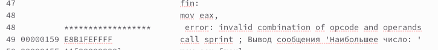{ #fig:009 width=70% }

# Задание для самостоятельной работы

1. Создаю файл *task.asm* и пишу в нем текст программы самостоятельной работы. Создаю исполняемый файл и проверяю его работу на числах 79, 83, 41 (вариант 6) (рис. 10 [-@fig:010])

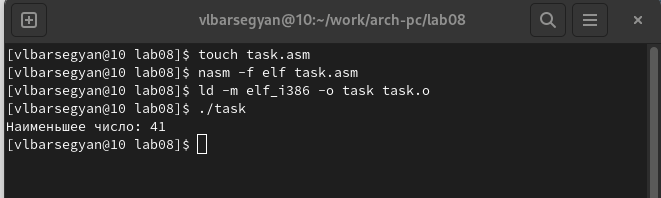{ #fig:010 width=70% }

2. Создаю файл *task2.asm* для задания 2. Выполняю задание 2, создаю исполняемый файл и проверяю на значениях для моего варианта (рис. 11 [-@fig:011])

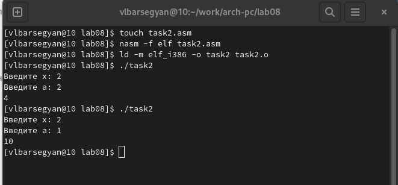{ #fig:011 width=70% }

# Выводы

Я изучил команды условного и безусловного переходов, научился писать программы с их использованием, узнал с назначение и структуру файла листинга, написал программы с использованием переходов для вычисления значения функций

