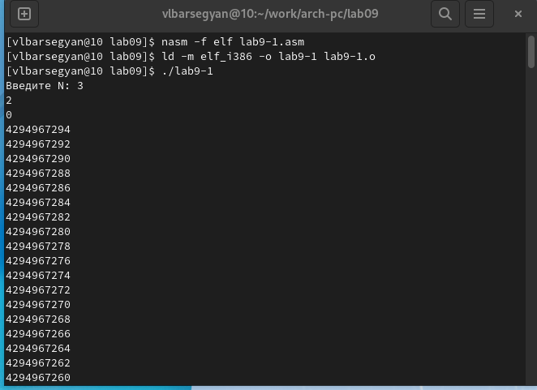
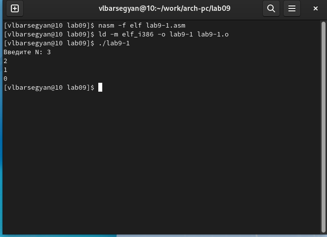
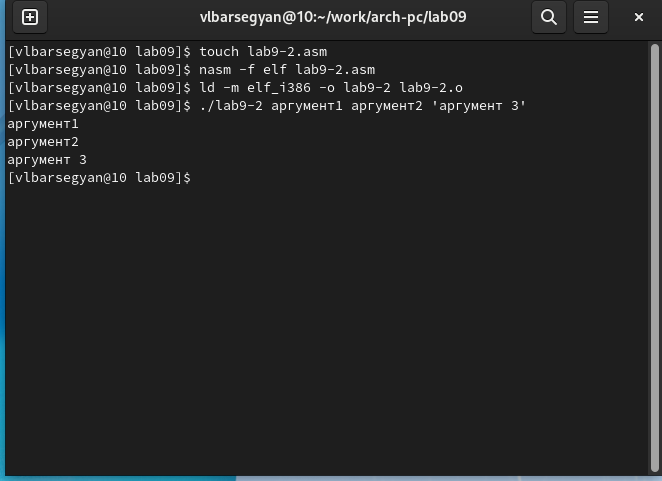
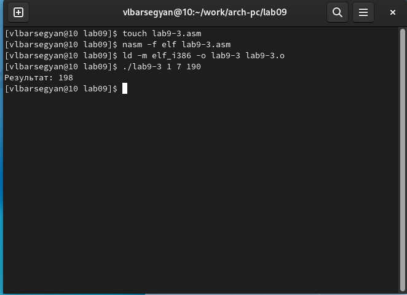
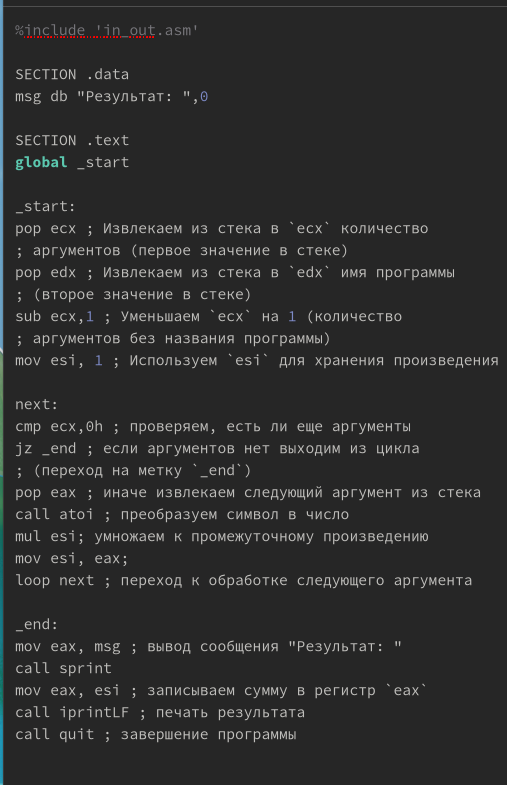
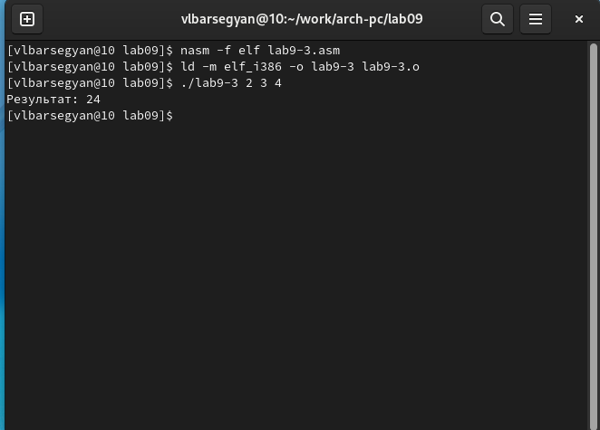
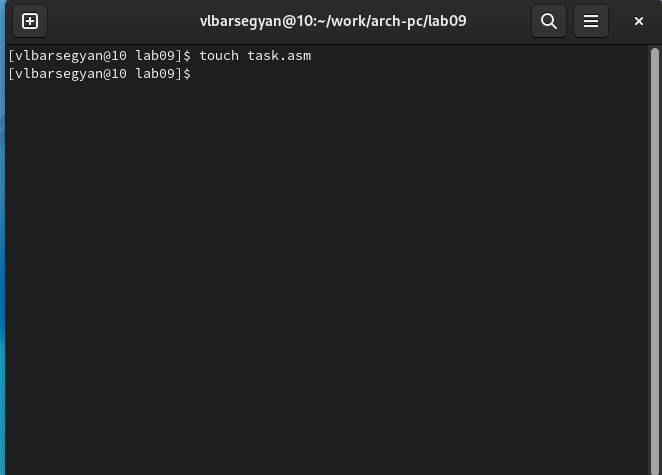
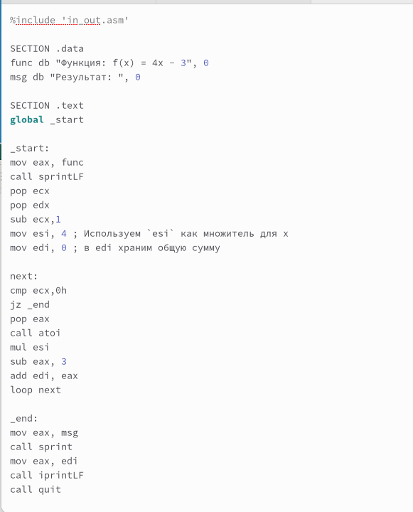
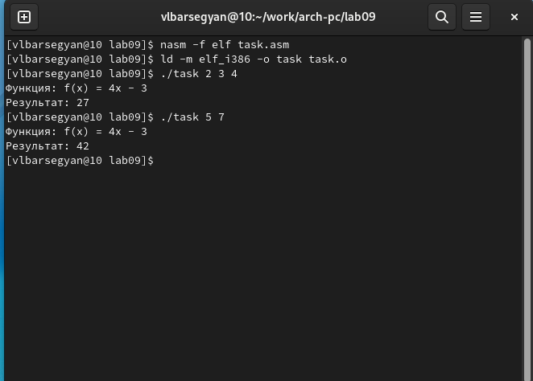

---
## Front matter
title: "Отчёт по лабораторной работе №9"
subtitle: "Дисциплина: Архитектура компьютера"
author: "Барсегян Вардан Левонович НПИбд-01-22"

## Generic otions
lang: ru-RU
toc-title: "Содержание"

## Bibliography
bibliography: bib/cite.bib
csl: pandoc/csl/gost-r-7-0-5-2008-numeric.csl

## Pdf output format
toc: true # Table of contents
toc-depth: 2
lof: true # List of figures
lot: true # List of tables
fontsize: 12pt
linestretch: 1.5
papersize: a4
documentclass: scrreprt
## I18n polyglossia
polyglossia-lang:
  name: russian
  options:
	- spelling=modern
	- babelshorthands=true
polyglossia-otherlangs:
  name: english
## I18n babel
babel-lang: russian
babel-otherlangs: english
## Fonts
mainfont: PT Serif
romanfont: PT Serif
sansfont: PT Sans
monofont: PT Mono
mainfontoptions: Ligatures=TeX
romanfontoptions: Ligatures=TeX
sansfontoptions: Ligatures=TeX,Scale=MatchLowercase
monofontoptions: Scale=MatchLowercase,Scale=0.9
## Biblatex
biblatex: true
biblio-style: "gost-numeric"
biblatexoptions:
  - parentracker=true
  - backend=biber
  - hyperref=auto
  - language=auto
  - autolang=other*
  - citestyle=gost-numeric
## Pandoc-crossref LaTeX customization
figureTitle: "Рис."
tableTitle: "Таблица"
listingTitle: "Листинг"
lofTitle: "Список иллюстраций"
lotTitle: "Список таблиц"
lolTitle: "Листинги"
## Misc options
indent: true
header-includes:
  - \usepackage{indentfirst}
  - \usepackage{float} # keep figures where there are in the text
  - \floatplacement{figure}{H} # keep figures where there are in the text
---

# Цель работы

Приобретение навыков написания программ с использованием циклов и
обработкой аргументов командной строки.

# Выполнение лабораторной работы

## Реализация циклов в NASM

1. Создаю каталог для программ лабораторной работы № 9, перехожу в него и создаю файл *lab9-1.asm*. В этот файл вставляю текст программы, создаю исполняемый файл и запускаю его (рис. [-@fig:001])

{ #fig:001 width=70% }

2. Изменяю текст программы и запускаю исполняемый файл (рис. [-@fig:002]). Теперь программа работает некорректно, и число проходов цикла не соответствует значению 𝑁, введенному с клавиатуры

{ #fig:002 width=70% }

3. Изменяю текст программы и запускаю исполняемый файл (рис. [-@fig:003]). Теперь число проходов цикла соответствует значению 𝑁, введенному с клавиатуры

{ #fig:003 width=70% }

## Обработка аргументов командной строки

4.  Создаю файл lab9-2.asm в каталоге *~/work/arch-pc/lab09* и ввожу в него текст программы из листинга 9.2. Запускаю исполняемый файл с указанием аргументов (рис. [-@fig:004]). Программа обработала поочередно все аргументы

{ #fig:004 width=70% }

5. Создаю файл lab9-3.asm в каталоге *~/work/arch-pc/lab09* и ввожу в него текст программы из листинга 9.3. Запускаю исполняемый файл с указанием аргументов (рис. [-@fig:005]). Программа вывела сумму всех введенных аргументов

{ #fig:005 width=70% }

6. Изменяю текст программы из листинга 9.3 для вычисления произведения
аргументов командной строки (рис. [-@fig:006]). Запускаю исполняемый файл и проверяю его работу (рис. [-@fig:007])

{ #fig:006 width=70% }

{ #fig:007 width=70% }

# Задание для самостоятельной работы

1. Создаю файл для выполнения самостоятельной работы (рис. [-@fig:008])

{ #fig:008 width=70% }

2. Пишу программу для выполнения варианта 6 (рис. [-@fig:009])

{ #fig:009 width=70% }

3. Создаю исполняемый файл и проверяю корректность работы программы (рис. [-@fig:010])

{ #fig:010 width=70% }

# Выводы

Я приобрел навыки написания программ с использованием циклов и обработкой аргументов командной строки. Написал программу для вычисления суммы значений от заданной функции, в которой аргументы вводятся с командной строки
