---
## Front matter
title: "Отчёт по лабораторной работе №10"
subtitle: "Дисциплина: Архитектура компьютера"
author: "Барсегян Вардан Левонович НПИбд-01-22"

## Generic otions
lang: ru-RU
toc-title: "Содержание"

## Bibliography
bibliography: bib/cite.bib
csl: pandoc/csl/gost-r-7-0-5-2008-numeric.csl

## Pdf output format
toc: true # Table of contents
toc-depth: 2
lof: true # List of figures
lot: true # List of tables
fontsize: 12pt
linestretch: 1.5
papersize: a4
documentclass: scrreprt
## I18n polyglossia
polyglossia-lang:
  name: russian
  options:
	- spelling=modern
	- babelshorthands=true
polyglossia-otherlangs:
  name: english
## I18n babel
babel-lang: russian
babel-otherlangs: english
## Fonts
mainfont: PT Serif
romanfont: PT Serif
sansfont: PT Sans
monofont: PT Mono
mainfontoptions: Ligatures=TeX
romanfontoptions: Ligatures=TeX
sansfontoptions: Ligatures=TeX,Scale=MatchLowercase
monofontoptions: Scale=MatchLowercase,Scale=0.9
## Biblatex
biblatex: true
biblio-style: "gost-numeric"
biblatexoptions:
  - parentracker=true
  - backend=biber
  - hyperref=auto
  - language=auto
  - autolang=other*
  - citestyle=gost-numeric
## Pandoc-crossref LaTeX customization
figureTitle: "Рис."
tableTitle: "Таблица"
listingTitle: "Листинг"
lofTitle: "Список иллюстраций"
lotTitle: "Список таблиц"
lolTitle: "Листинги"
## Misc options
indent: true
header-includes:
  - \usepackage{indentfirst}
  - \usepackage{float} # keep figures where there are in the text
  - \floatplacement{figure}{H} # keep figures where there are in the text
---

# Цель работы

Приобретение навыков написания программ с использованием подпрограмм.
Знакомство с методами отладки при помощи GDB и его основными возможностями.

# Теоретическое введение
Отладка — это процесс поиска и исправления ошибок в программе. В общем
случае его можно разделить на четыре этапа:
• обнаружение ошибки;
• поиск её местонахождения;
• определение причины ошибки;
• исправление ошибки.

Можно выделить следующие типы ошибок:
• синтаксические ошибки — обнаруживаются во время трансляции исходного кода и вызваны нарушением ожидаемой формы или структуры языка;
• семантические ошибки — являются логическими и приводят к тому, что
программа запускается, отрабатывает, но не даёт желаемого результата;
• ошибки в процессе выполнения — не обнаруживаются при трансляции и
вызывают прерывание выполнения программы (например, это ошибки,
связанные с переполнением или делением на ноль).

# Выполнение лабораторной работы

## Реализация подпрограмм в NASM

1. Создаю каталог для выполнения лабораторной работы № 10, перехожу в него и создаю файл *lab10-1.asm* (рис. [-@fig:001])

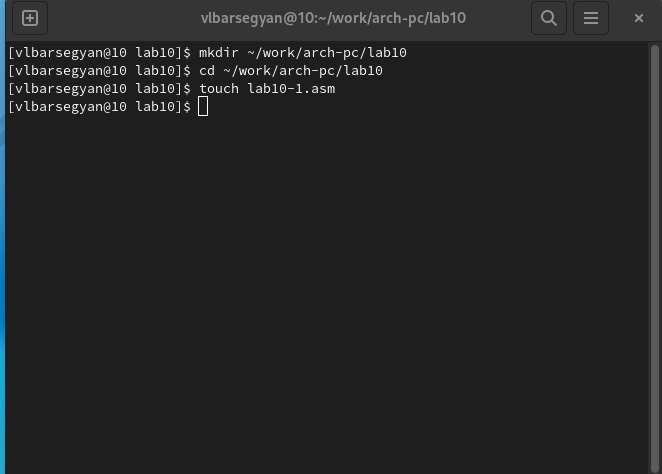{ #fig:001 width=70% }

2. Ввожу в файл текст программы листинга 1 - программа вычисления арифметического выражения 𝑓(𝑥) = 2𝑥 + 7 с помощью подпрограммы _calcul. В данном примере 𝑥 вводится с клавиатуры, а само выражение вычисляется в подпрограмме (рис. [-@fig:002]), компилирую и запускаю исполняемый файл (рис. [-@fig:003])

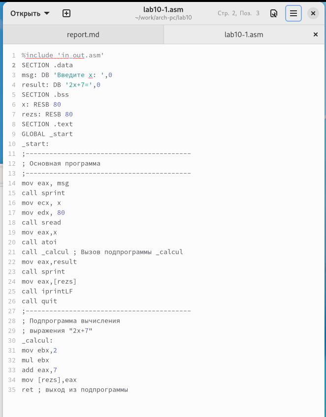{ #fig:002 width=70% }

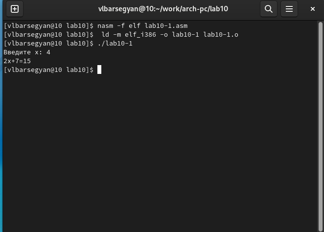{ #fig:003 width=70% }

3. Изменяю текст программы, добавив подпрограмму _subcalcul (рис. [-@fig:004]). Компилирую исполняемый файл и проверяю его работу (рис. [-@fig:005])

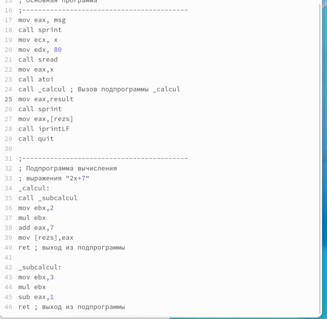{ #fig:004 width=70% }

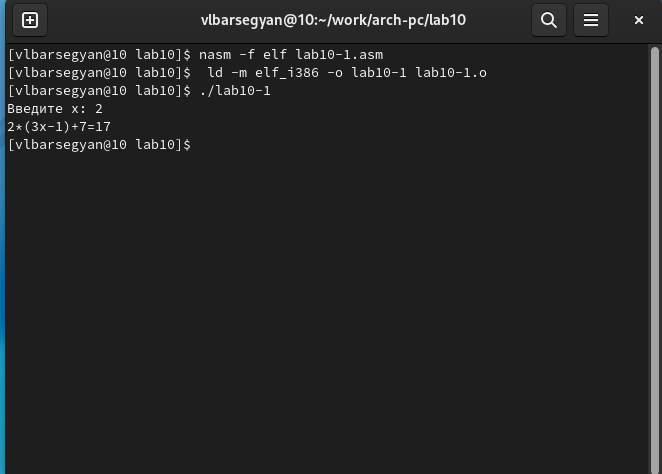{ #fig:005 width=70% }

## Отладка программам с помощью GDB

4. Создаю файл *lab10-2.asm* с помощью команды *touch lab10-2.asm* с текстом программы из Листинга 10.2 (Программа печати сообщения Hello world!) (рис. [-@fig:006])

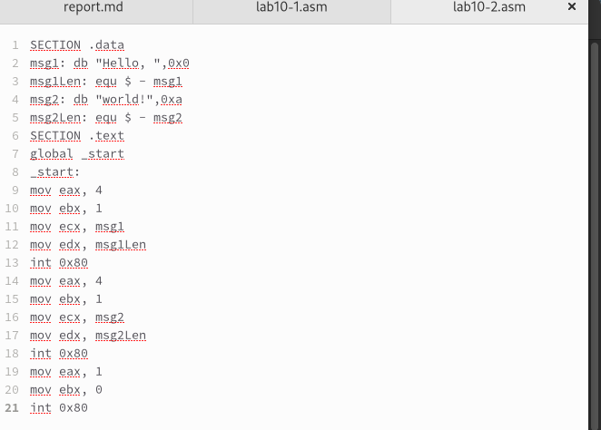{ #fig:006 width=70% }

5. Создаю исполняемый файл, добавив отладочную информацию с помощью ключа *-g* и загружаю его в отладчик GDB (рис. [-@fig:007])

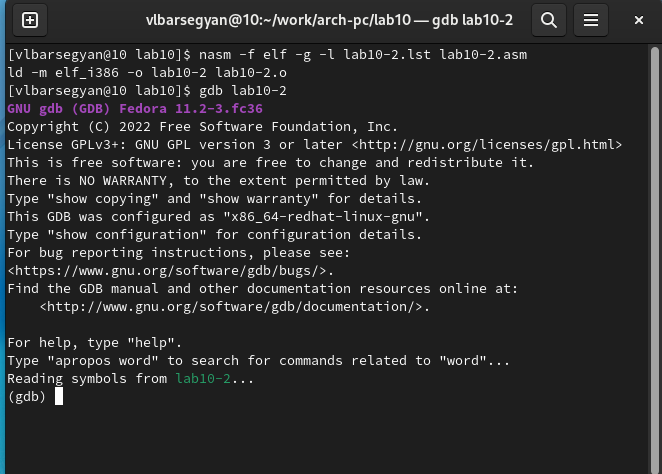{ #fig:007 width=70% }

6. Проверяю работу программы, запустив ее в оболочке GDB с помощью команды run (рис. [-@fig:008])

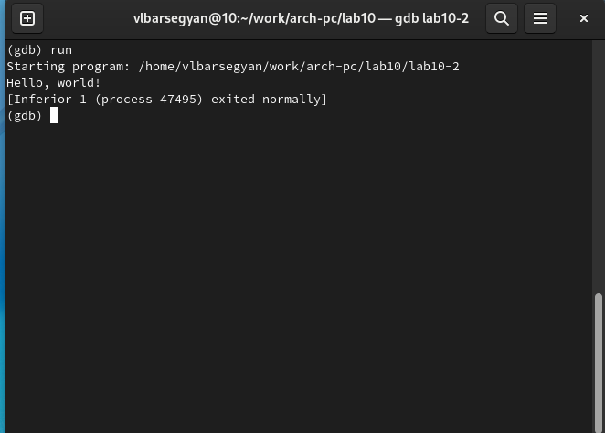{ #fig:008 width=70% }

7. Устанавливаю брейкпоинт на метку _start и запускаю её (рис. [-@fig:009])

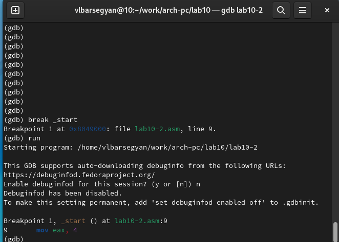{ #fig:009 width=70% }

8. Смотрю дисассимилированный код программы с помощью команды disassemble начиная с метки _start (рис. [-@fig:010])

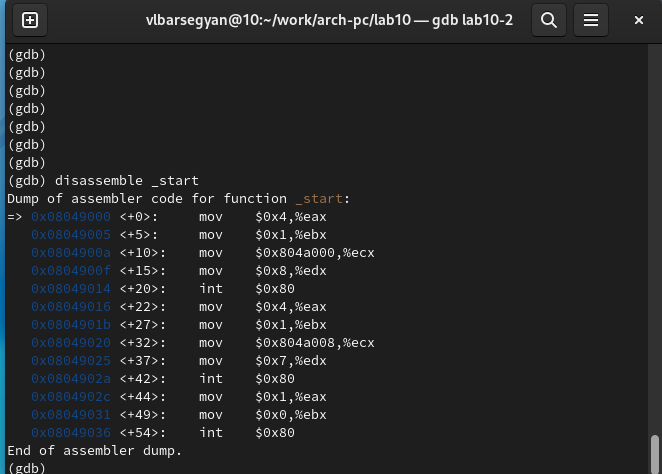{ #fig:010 width=70% }

9. Переключаюсь на отображение команд с Intel’овским синтаксисом, введя
команду *set disassembly-flavor intel* (рис. [-@fig:011]). После смены интерфейса команды отображаются с привычным Intel’овским синтаксисом 

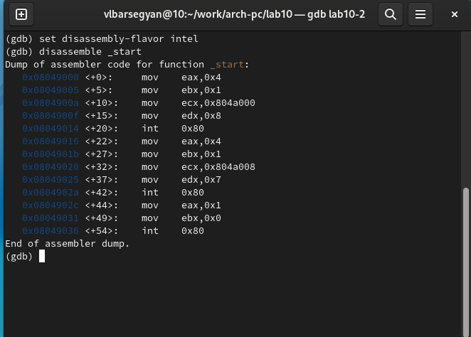{ #fig:011 width=70% }

10. Включаю режим псевдографики для более удобного анализа программы (рис. [-@fig:012], [-@fig:013])

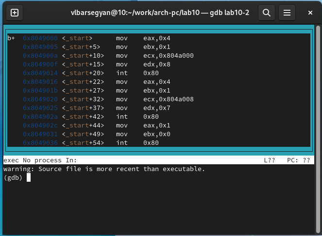{ #fig:012 width=70% }

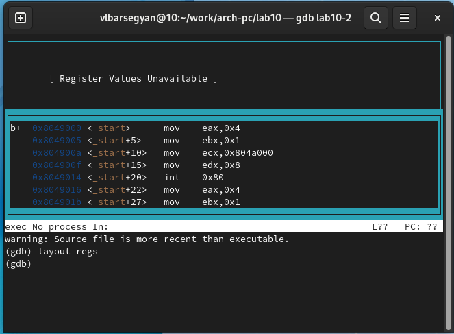{ #fig:013 width=70% }

### Добавление точек останова

11. Проверяю установку точки остановы по имени метки (_start) с помощью команды *i b* (рис. [-@fig:014])

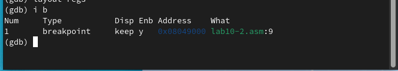{ #fig:014 width=70% }

12. Адрес предпоследней инструкции - 0x8049031. Устанавливаю точку остановы по этому адресу и проверяю все такие точки (рис. [-@fig:015])

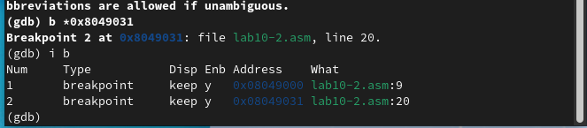{ #fig:015 width=70% }

### Работа с данными программы в GDB

13. Выполняю 5 инструкций stepi (si). Каждый раз выполняется соответствующая инструкция, и подсвечивается соответствующее изменение (рис. [-@fig:016])

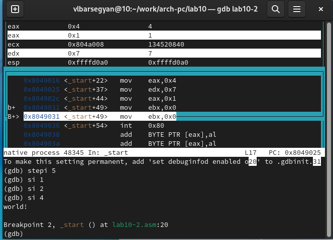{ #fig:016 width=70% } 

14. Посмотреть содержимое регистров также можно с помощью команды info
registers (или i r). (рис. [-@fig:017])

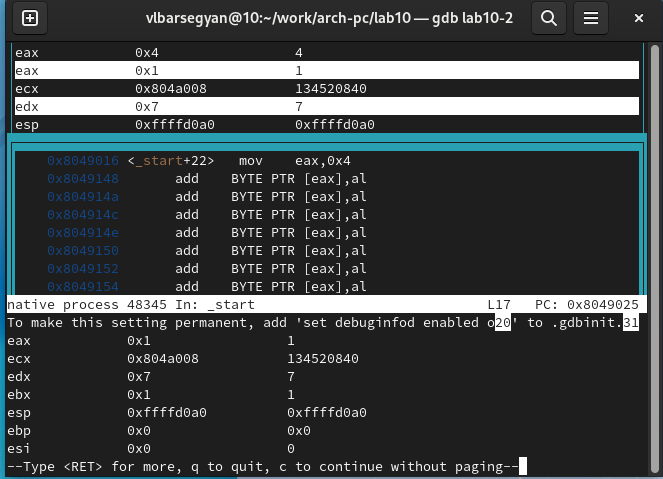{ #fig:017 width=70% } 

15. Смотрю значение переменной msg1 по имени, а значение переменной msg2 - по адресу (рис. [-@fig:018])

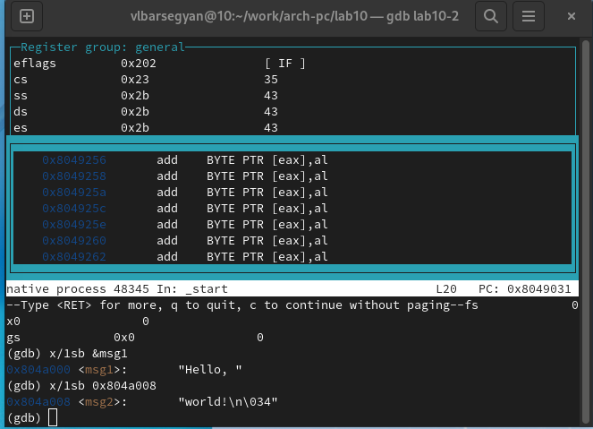{ #fig:018 width=70% } 

16. Изменяю первый символ переменной msg1 и два символа в переменной msg2, используя ее адрес (рис. [-@fig:019])

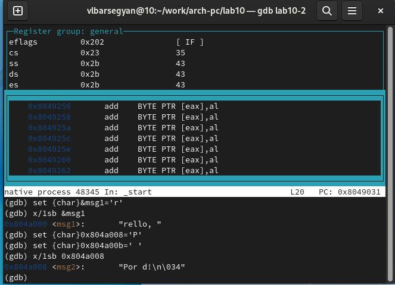{ #fig:019 width=70% } 

17. Вывожу значение регистра edx в различных форматах (p/x - шестнадцатеричный, p/t - двоичный, p/s - символьный) (рис. [-@fig:020])

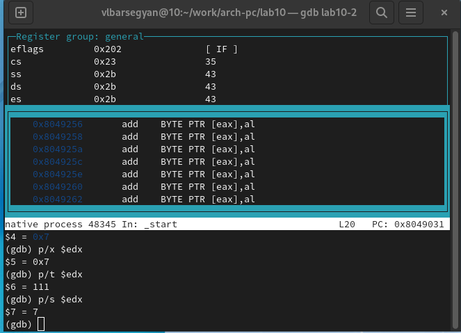{ #fig:020 width=70% }

18. С помощью команды set изменяю значение регистра ebx (рис. [-@fig:021]). Разница в выводе в том, что в первом случае 2 вводится как символ, и в символьном виде выводится ascii-номер символа, во втором же случае 2 вводится как число и в символьном виде показывается как число

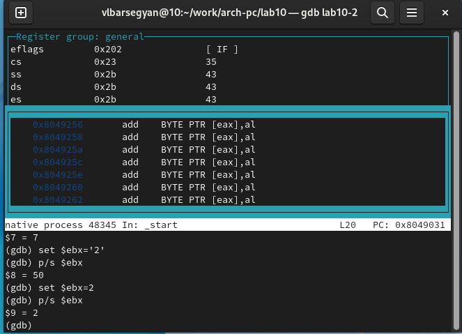{ #fig:021 width=70% }

19. Продолжаю выполнение программы с помощью команды *с* и выхожу из GDB с помощью команды *q* (рис. [-@fig:022])

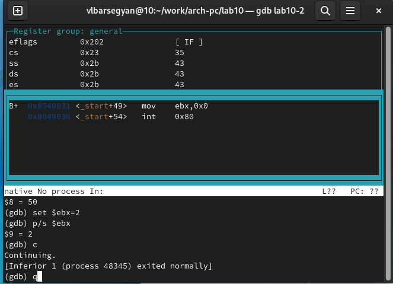{ #fig:022 width=70% }

### Обработка аргументов командной строки в GDB

20. Копирую файл *lab9-2.asm*, созданный при выполнении лабораторной работы №9 в файл с именем *lab10-3.asm* и создаю исполняемого файла (рис. [-@fig:023])

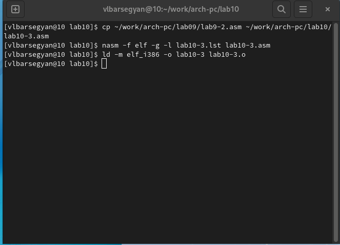{ #fig:023 width=70% }

21. Загружаю исполняемый файл в отладчик, используя следующие аргументы (рис. [-@fig:024])

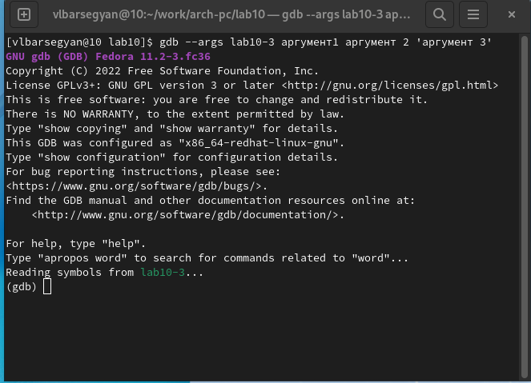{ #fig:024 width=70% } 

22. Устанавливаю точку останова перед первой инструкцией в программе
и запускаю ее (рис. [-@fig:025])

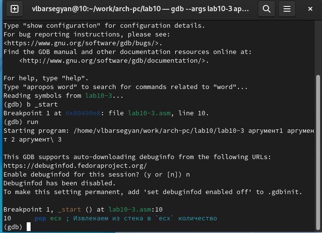{ #fig:025 width=70% }
 
23. Смотрю позиции стека по их адресам (рис. [-@fig:026]). Шаг изменения адреса равен 4, т.к. размер переменной - 4 байта

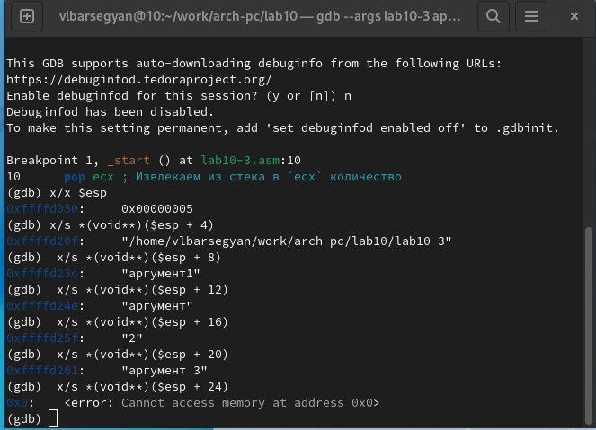{ #fig:026 width=70% }

# Задания для самостоятельной работы

1. Создаю файл *task1.asm*, пишу текст программы (Преобразуйте программу из лабораторной работы №9 (Задание №1 для самостоятельной работы), реализовав вычисление значения функции 𝑓(𝑥) как подпрограмму) (рис. [-@fig:027]). Компилирую исполняемый файл и проверяю его работу (рис. [-@fig:028])

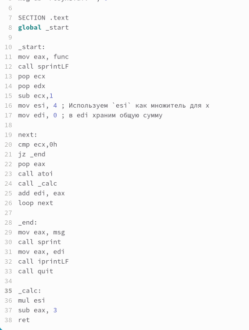{ #fig:027 width=70% }

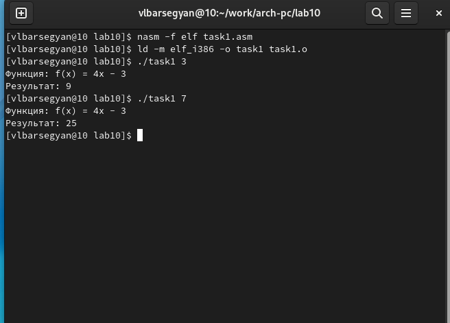{ #fig:028 width=70% }

2. Создаю файл *task2.asm*, ввожу текст программы из листинга 10.4 (рис. [-@fig:029])

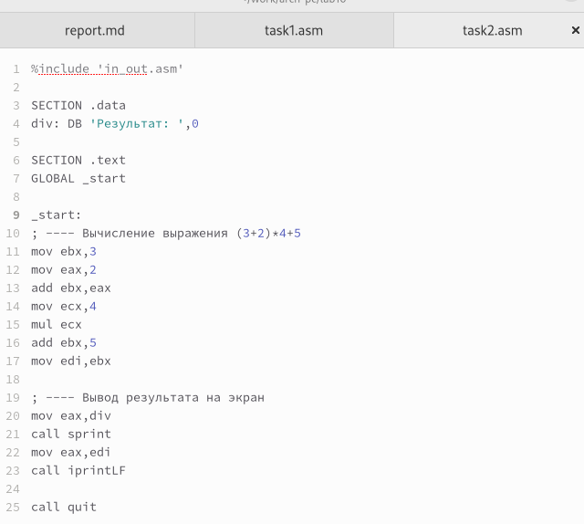{ #fig:029 width=70% }

3. Открываю отладчик GDB, отлаживаю код (рис. [-@fig:030]). В коде перепутаны местами регистры ebx и eax в команде add, а также в регистр edi копируются данные из регистра ebx, а не eax. Также 5 должно прибавлять к значению регистра eax, а не ebx

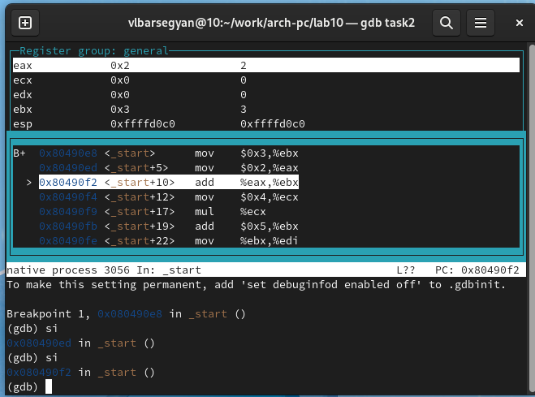{ #fig:030 width=70% } 

4. Исправленный код программы (рис. [-@fig:031])

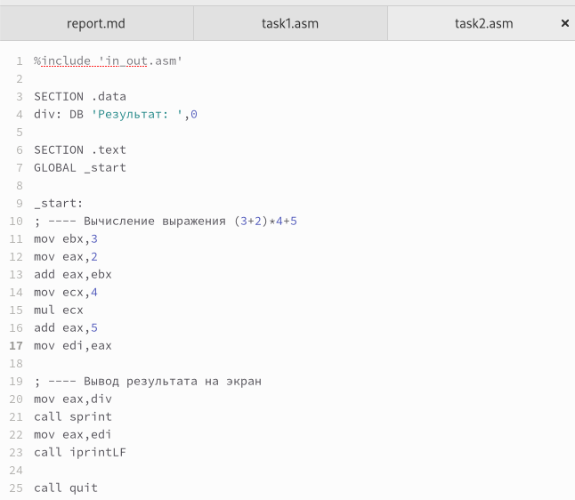{ #fig:031 width=70% }

5. Проверяю правильность работы программы (рис. [-@fig:032])

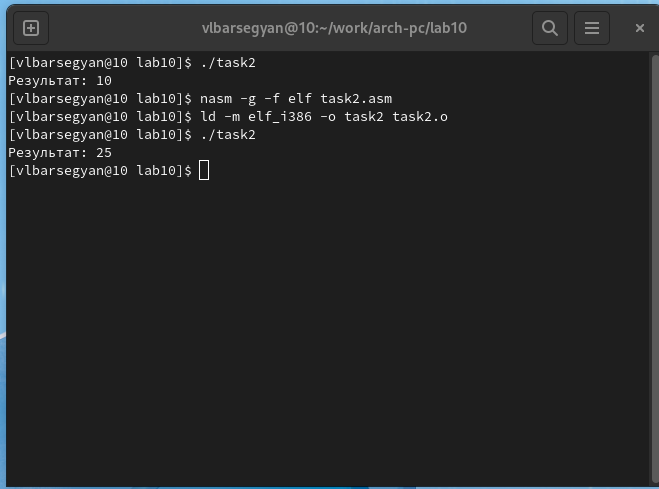{ #fig:032 width=70% }

# Выводы

Я научился писать программы с использованием подпрограмм, переписал старую программу с использованием подпрограммы. Узнал, что такое отладка и как пользоваться отладчиком GDB и познакомился с его основными возможностями 

