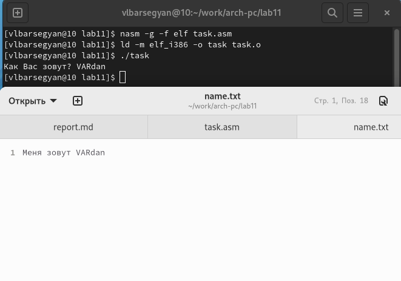

---
## Front matter
title: "Отчёт по лабораторной работе №11"
subtitle: "Дисциплина: Архитектура компьютера"
author: "Барсегян Вардан Левонович НПИбд-01-22"

## Generic otions
lang: ru-RU
toc-title: "Содержание"

## Bibliography
bibliography: bib/cite.bib
csl: pandoc/csl/gost-r-7-0-5-2008-numeric.csl

## Pdf output format
toc: true # Table of contents
toc-depth: 2
lof: true # List of figures
lot: true # List of tables
fontsize: 12pt
linestretch: 1.5
papersize: a4
documentclass: scrreprt
## I18n polyglossia
polyglossia-lang:
  name: russian
  options:
	- spelling=modern
	- babelshorthands=true
polyglossia-otherlangs:
  name: english
## I18n babel
babel-lang: russian
babel-otherlangs: english
## Fonts
mainfont: PT Serif
romanfont: PT Serif
sansfont: PT Sans
monofont: PT Mono
mainfontoptions: Ligatures=TeX
romanfontoptions: Ligatures=TeX
sansfontoptions: Ligatures=TeX,Scale=MatchLowercase
monofontoptions: Scale=MatchLowercase,Scale=0.9
## Biblatex
biblatex: true
biblio-style: "gost-numeric"
biblatexoptions:
  - parentracker=true
  - backend=biber
  - hyperref=auto
  - language=auto
  - autolang=other*
  - citestyle=gost-numeric
## Pandoc-crossref LaTeX customization
figureTitle: "Рис."
tableTitle: "Таблица"
listingTitle: "Листинг"
lofTitle: "Список иллюстраций"
lotTitle: "Список таблиц"
lolTitle: "Листинги"
## Misc options
indent: true
header-includes:
  - \usepackage{indentfirst}
  - \usepackage{float} # keep figures where there are in the text
  - \floatplacement{figure}{H} # keep figures where there are in the text
---

# Цель работы

Приобретение навыков написания программ для работы с файлами.

# Выполнение лабораторной работы

1. Создаю каталог для программ лабораторной работы № 11, перехожу
в него и создаю файлы *lab11-1.asm* и *readme.txt* (рис. [-@fig:001])

{ #fig:001 width=70% }

2. Ввожу в файл *lab11-1.asm* текст программы из листинга 11.1 (Программа
записи в файл сообщения) (рис. [-@fig:002]). Создаю исполняемый файл и проверяю его работу (рис. [-@fig:003])

{ #fig:002 width=70% }

{ #fig:003 width=70% }

3. С помощью команды *chmod* изменяю права доступа к исполняемому файлу *lab11-1*, запретив его выполнение (рис. [-@fig:004]). После запрета его выполнения в консоли выводится отказ в доступе

{ #fig:004 width=70% }

4. С помощью команды *chmod* изменяю права доступа к файлу *lab11-1.asm* с исходным текстом программы, добавив права на исполнение (рис. [-@fig:005]). До добавления прав на исполнение выполнить файл было нельзя, отказ в доступе, после добавления прав файл выполнялся

{ #fig:005 width=70% }

5. **Вариант 6, предоставить права доступа -w- r-x -w- файлу readme.txt.**
Для предоставления таких прав доступа следует представить запись в двоичной, а затем восьмеричной системе: -w-r-x-w- = 010101010 = 252 в восьмеричной, и поменять права доступа с помощью команды *chmod* (рис. [-@fig:006])

{ #fig:006 width=70% }

# Задание для самостоятельной работы

1. Создаю файл *task.asm* для выполнения с/р, пишу в нем текст программы (рис. [-@fig:007])

{ #fig:007 width=70% }

2. Создаю исполняемый файл, проверяю его работу (рис. [-@fig:008])

{ #fig:008 width=70% }

3. Проверяю созданный текстовый файл с помощью команды *ls* (рис. [-@fig:009])

{ #fig:009 width=70% }

4. Проверяю содержимое файла с помощью команды *cat* (рис. [-@fig:010])

{ #fig:010 width=70% }

# Выводы

Я ознакомился с правами доступа к файлам, ознакомился как открывать, создавать, удалять, читать, записывать закрывать и изменять содержимое файлов. Также я написал программу для считывания данных с консоли и их записи в файл
